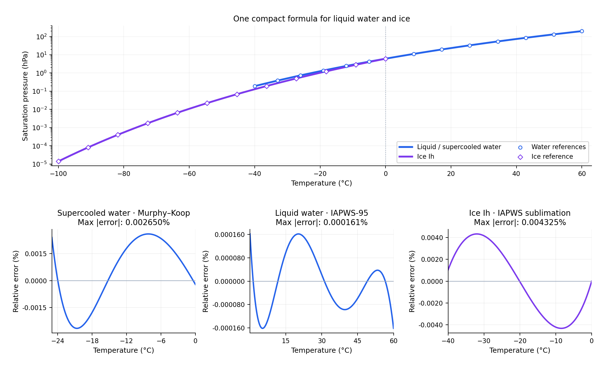

# water-sat-pressure-2p

A quadratic approximation of saturation vapor pressure, using four coefficients
per set: one shared by liquid and supercooled water, and one for ice Ih.
The formulation has an analytic inverse for dew point or frost point and an
analytic derivative.



## Formulation

With temperature $T$ in °C and saturation pressure $E_s$ in hPa:

$$
z=\frac{T}{b+T},\qquad \ln E_s(T)=E_0+a z+c z^2.
$$

For $y=\ln(e)-E_0$, the inverse is

$$
z=\frac{2y}{a+\sqrt{a^2+4cy}},\qquad T=\frac{b z}{1-z}.
$$

## Coefficients

| Coefficient | Liquid / supercooled water | Ice Ih |
| --- | ---: | ---: |
| `E0` | 1.8102727796 | 1.8101778161088404 |
| `a` | 23.861922139 | 25.601017686 |
| `b` | 328.35966469 | 310.80657620 |
| `c` | −8.4297415170 | −3.7233760080 |
| Domain (°C) | −40 → 100 | −100 → 0.01 |

The water fit prioritizes 0.01–60 °C, with a slight adjustment below freezing.
The ice fit prioritizes −40–0.01 °C and limits extended-range error to about
0.1%; its triple point is fixed at 611.657 Pa and 0.01 °C.

Coefficients use 11 significant digits, except ice `E0`, which is derived
from the rounded coefficients to retain the triple-point anchor.

## Relative errors

**Primary ranges**

| Phase | Reference | Range (°C) | RMSE (%) | Max abs. err (%) |
| --- | --- | --- | ---: | ---: |
| Liquid water | IAPWS-95 | 0.01 → 60 | 0.000092 | 0.000161 |
| Supercooled water | Murphy–Koop | −25 → 0.01 | 0.001830 | 0.002650 |
| Ice Ih | IAPWS R14-08(2011) | −40 → 0.01 | 0.003138 | 0.004325 |

**Extended ranges**

| Phase | Reference | Range (°C) | RMSE (%) | Max abs. err (%) |
| --- | --- | --- | ---: | ---: |
| Liquid water | IAPWS-95 | 0.01 → 100 | 0.011071 | 0.043494 |
| Supercooled water | Murphy–Koop | −40 → 0.01 | 0.086786 | 0.341670 |
| Ice Ih | IAPWS R14-08(2011) | −100 → 0.01 | 0.048709 | 0.100000 |

Errors are evaluated on endpoint-inclusive 0.05 °C grids against the reference
formulations. They describe approximation error, not physical uncertainty.

A separate [cubic variant](docs/API.md#general-family-and-cubic-alternative)
uses five coefficients for liquid water over 0.01–100 °C, with a maximum
relative error of 0.000376% against IAPWS-95. It is provided as an optional
coefficient set; the package API uses the quadratic fits above.

## Usage

From a local checkout:

```bash
pip install .
```

```python
from wsp2p import esat_water_hpa, T_from_e_water, esat_ice_hpa, T_from_e_ice

water_pressure = esat_water_hpa(20.0)    # ≈ 23.3932 hPa
water_T = T_from_e_water(water_pressure) # 20 °C
ice_pressure = esat_ice_hpa(-20.0)        # ≈ 1.03239 hPa
ice_T = T_from_e_ice(ice_pressure)        # −20 °C
```

Functions accept NumPy arrays. Invalid or out-of-domain inputs return `NaN`
elementwise. Water and ice are selected explicitly; humidity is referenced
to the corresponding phase.

## Documentation

- [API reference, input conventions and optional cubic coefficients](docs/API.md).
- [Benchmark notebook](notebooks/Benchmarks.ipynb); dependencies: `pip install -e '.[dev]'`.
- Coefficient files: [water](src/wsp2p/coeffs.json), [ice](src/wsp2p/coeffs_ice.json).

## References and license

- Wagner & Pruß (2002), IAPWS-95. DOI: [10.1063/1.1461829](https://doi.org/10.1063/1.1461829).
- Murphy & Koop (2005), vapor pressures of ice and supercooled water. DOI: [10.1256/qj.04.94](https://doi.org/10.1256/qj.04.94).
- [IAPWS R14-08(2011)](https://iapws.org/technical-guidance/release/MeltSub), melting and sublimation curves.

Code: [Apache License](LICENSE). Notebooks and figures: CC-BY-4.0.
Derived from [HarmoClimate](https://github.com/smozzi/harmo-climate).
